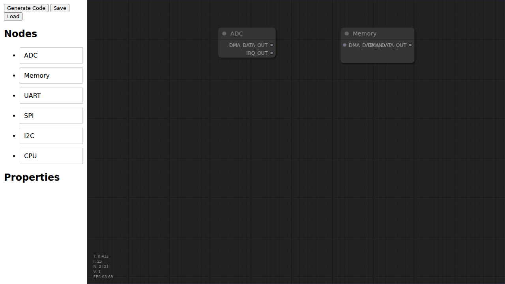
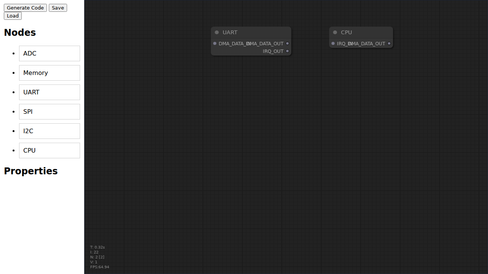
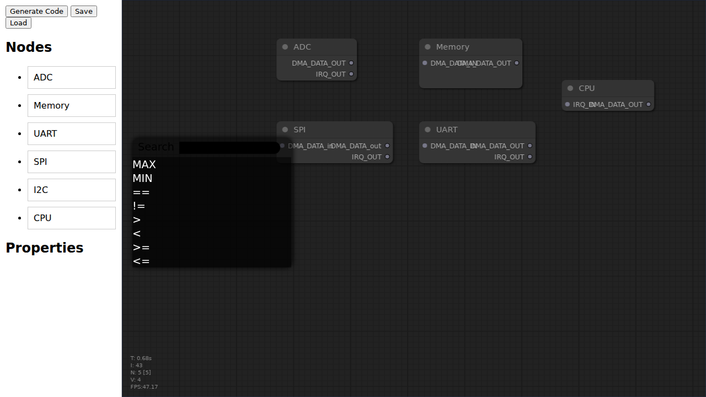

# RP2040 DMA & Interrupt Configuration UI Documentation

This document provides an overview of the UI and showcases some example configurations.

## Example Scenarios

### Scenario 1: ADC to Memory

This example demonstrates a simple DMA chain where the ADC continuously writes data to a memory buffer.

### Scenario 2: UART to CPU Interrupt

This example shows how to configure the UI to trigger a CPU interrupt when data is received on a UART.

### Scenario 3: Multi-peripheral Setup

This example showcases a more complex configuration involving multiple peripherals and DMA channels.

